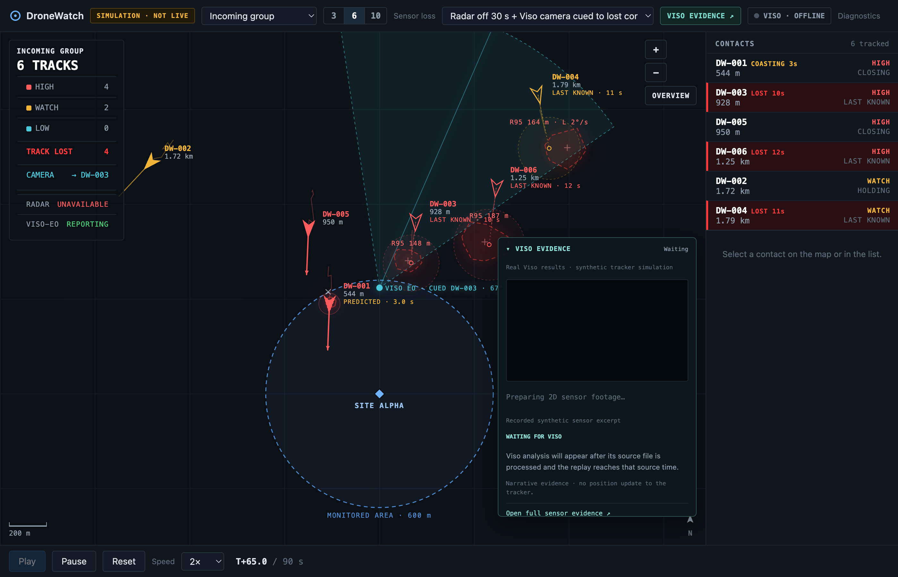

# DroneWatch

DroneWatch is a prototype counter-drone (counter-UAS) tracking and
incident-awareness system in Python. A FastAPI server runs a Kalman-filter
tracker over synthetic multi-sensor reports, replays the result in a browser
operator view, and estimates where a contact could be once its sensor stops
reporting. It also receives visual-analysis results from Viso Now through a
webhook.

Everything the tracker sees is synthetic, generated from fixed seeds by
`dronewatch/synthetic/`. No real radar or RF hardware is connected, there is no
live camera stream, and no model is trained. Viso Now results are stored and
shown as evidence; they do not feed positions to the tracker.

> Maturity: prototype. It is not a calibrated radar, a certified counter-UAS
> system, or proof of live airspace coverage. Sensor characteristics are
> invented simulation abstractions, not the performance of any real product.

**Key results**, committed in
[`docs/results/sensor_loss_quick.md`](docs/results/sensor_loss_quick.md):

- Filter consistency over 400 independent runs of the filter's own model: mean
  NEES (4 degrees of freedom) is 4.18, 3.95 and 3.98 at three check points, all
  inside the 95% band [3.72, 4.28]. The 95% position ellipse contains the true
  position in 0.97 of runs during normal tracking and 0.95 at the end of a
  10 s prediction-only gap.
- Full pipeline, six contacts, radar off for 15 s, four held-out seeds:
  position RMSE rises from 8.22 m before the outage to 59.67 m during it, the
  95% ellipse still contains the true position in 0.99 of track-frames, there
  are no identity switches, and all six contacts have a fresh position again
  1.0 s after the radar returns (mean over the four seeds).
- Failures are reported rather than tuned away: a crossing pair averages one
  identity switch per run, and a 30 s outage outlasts the 25 s track retention,
  so all six contacts come back as new identities.



*The operator view (`/preview?demo=viso`) captured from a local run: seed 42, six
synthetic contacts, radar off from 40 to 70 s, simulated camera (labelled
VISO-EO) cued by the tracker. All data is synthetic, and no Viso Now results had
been received.*

## System architecture



*Purple: model call · blue: deterministic code · green: human · amber: evaluation · grey: storage · dashed: external, optional, mocked or planned*

The operator picks a scenario, contact count and sensor-loss mode.
`GET /api/preview/tracks` then generates seeded synthetic observations and
sensor heartbeats with those faults, runs the tracker over them once in
delivery order, and returns 5 Hz frames (estimates, covariances, containment
regions, rule-based priority levels) that the browser replays. In the cued
camera mode the tracker runs twice: a radar-only pass decides where the
simulated camera points, and a second pass adds its synthetic detections. Viso
Now results enter only through the webhooks, are stored in SQLite and shown as
non-spatial evidence, and never update a track. Ground truth never reaches the
server or the browser; only `experiments/sensor_loss.py`, the tests and the
offline dataset export (`python -m dronewatch.synthetic.generate`) read it.

## Does it use AI at runtime?

No. This repository contains no machine-learning model, LLM or trained
component: tracking, containment, priority levels and camera cueing are
deterministic or seeded Monte Carlo code. Visual analysis, when used, happens
in the external Viso Now service, whose results are kept as evidence only.

## Quick start

Requires Python 3.11+. Node.js 24+ is needed only for the JavaScript tests. No
API keys are needed for the tracker, the preview or the test suite.

```bash
git clone https://github.com/retinapeg/dronewatch.git
cd dronewatch
python3 -m venv .venv
.venv/bin/python -m pip install --upgrade pip setuptools
.venv/bin/python -m pip install -r requirements.txt
.venv/bin/python -m pytest -q
.venv/bin/uvicorn main:app --host 127.0.0.1 --port 8000
```

Open <http://127.0.0.1:8000/preview>, pick a sensor-loss mode and press Play.
To regenerate the results tables:

```bash
.venv/bin/python -m experiments.sensor_loss                  # writes docs/results/sensor_loss_quick.{md,json}
.venv/bin/python -m experiments.sensor_loss --out /tmp/dw    # write elsewhere instead
```

The runs are seeded, so a rerun reproduces the tables apart from the wall-clock
`ms` column. `--full` runs 20 held-out seeds and 2000 filter-consistency runs.

## Tracking and estimation

The derivations, parameter choices and an equation-to-test map are in
[`docs/SENSOR_LOSS_MATH.md`](docs/SENSOR_LOSS_MATH.md). In summary:

### Kalman filter

[`dronewatch/tracks/kalman.py`](dronewatch/tracks/kalman.py), tested in
[`tests/test_kalman.py`](tests/test_kalman.py).

- State `[p_x, p_y, v_x, v_y]` in a local planar frame. Altitude is carried
  beside the track, not estimated.
- Nearly-constant-velocity motion with continuous white-noise acceleration.
  `F(dt)` and `Q(dt)` are derived from the SDE `dp = v dt, dv = dW`, and
  prediction uses the actual elapsed event time, so a gap predicted in one step
  or in many gives the same distribution. A deliberate negative test shows the
  discrete "random constant acceleration" model does not have this property.
- Joseph-form covariance update, `P = (I - KH) P (I - KH)^T + K R K^T`, with the
  gain obtained by a Cholesky solve rather than a matrix inverse. Measurement
  covariances are validated before use.
- Position (full or single-axis) and bearing-only measurement models. The
  bearing innovation is wrapped to (-pi, pi], and a bearing can refine a track
  but cannot start one.
- The estimation code is pure Python; numpy is not in `requirements.txt`.

### Association and track management

[`dronewatch/tracks/tracker.py`](dronewatch/tracks/tracker.py).

- Chi-squared gating on the innovation: `d^2 = nu^T S^-1 nu <= 25` for 2-dof
  position reports and `<= 13` for 1-dof bearings. The 2-dof gate is
  deliberately loose (beyond the 99.99% point of chi-squared(2)) so that a
  constant-velocity filter lagging a gentle turn does not spawn a phantom.
- Among gated candidates the tracker picks the lowest `d^2 + ln|S|`, so a track
  with a huge covariance does not win every report. A margin below 2 to the
  runner-up is recorded as an ambiguous association. Association is greedy
  nearest-neighbour, not a joint assignment.
- Late reports within 1.5 s are applied by rolling back to a checkpoint and
  replaying, which reproduces the in-order posterior (tested to 1e-9). Older
  reports are rejected and counted; duplicates are dropped by observation ID.
- Lifecycle, freshness and source health are separate states. Source health
  comes from sensor heartbeats, never from the absence of detections.

### Lost contacts: Itô SDE Monte Carlo containment

[`dronewatch/tracks/uncertainty.py`](dronewatch/tracks/uncertainty.py), tested
in [`tests/test_sensor_loss.py`](tests/test_sensor_loss.py), served by
`GET /api/preview/paths`.

- When a contact stops being observed, sample paths of the tracker's own Itô
  SDE forward from a draw of the track's estimated state and covariance,
  stepped with Euler-Maruyama.
- For this model the closed form exists, so the sampler is used as a check and
  as something an operator can read. `test_monte_carlo_agrees_with_the_closed_form`
  requires the sampled 95% radius to be within 4% of the analytic one and the
  empirical containment to lie in [0.93, 0.97] at 5, 20 and 40 s.
- The reported R95 is the major semi-axis of the 95% ellipse (chi-squared(2)
  quantile 5.991): the smallest circle centred on the estimate that contains
  the whole ellipse, so it never understates the search area.
- A behaviour-adaptive variant fits the recent track history for speed,
  heading and turn rate, samples a weighted mixture of coordinated-turn
  regimes with a speed bound, and draws the convex hull of the innermost 95% of
  endpoints. The mixture has no closed form, and its weights are stated in the
  code rather than fitted.
- A handover check reports when a track's containment radius has outgrown an
  illustrative sensor acquisition basket. It is decision support that fails
  closed, not fire control.

### Evaluation: NEES, NIS and pipeline metrics

[`experiments/sensor_loss.py`](experiments/sensor_loss.py) evaluates two layers
separately, because a correct filter can still sit inside a tracker that
associates the wrong measurements.

**Layer A, matched-model consistency.** Truth is generated by the filter's own
model with known association, 400 independent runs, a 10 s blackout from step
40 to step 59, NEES and NIS read at fixed steps.

| statistic | value | 95% band for the mean |
|---|---|---|
| NEES(4) mean, step 20 | 4.177 | [3.72, 4.28] |
| NEES(4) mean, step 39 | 3.947 | [3.72, 4.28] |
| NEES(4) mean, step 79 | 3.984 | [3.72, 4.28] |
| NIS(2) mean, step 20 | 2.066 | [1.8, 2.2] |
| NIS(2) mean, step 39 | 1.851 | [1.8, 2.2] |
| NIS(2) mean, step 79 | 1.911 | [1.8, 2.2] |
| 95% ellipse coverage, normal | 0.97 | nominal 0.95 |
| 95% ellipse coverage, end of 10 s gap | 0.95 | nominal 0.95 |

**Layer B, the full pipeline.** The 3, 6 and 10-contact tracker with
association, delivery effects and injected faults, scored against ground truth
the tracker never sees. Held-out seeds 2024, 31337, 99 and 555; the development
seeds 42, 7 and 1234 are excluded. Values are means per run; "during" is the
fault window; recovery was achieved in all four runs of every experiment.

| experiment | contacts | during: RMSE (m) / 95% coverage | missing | fragments | id switches | impure tracks | recovery (s) |
|---|---|---|---|---|---|---|---|
| `normal` | 6 | 8.62 / 0.99 | 0.0 | 0 | 0 | 0 | 0.2 |
| `radar_off_5s` | 6 | 19.52 / 1.0 | 0.0 | 0 | 0 | 0 | 1.0 |
| `radar_off_15s` | 6 | 59.67 / 0.99 | 0.0 | 0 | 0 | 0 | 1.0 |
| `radar_off_30s` | 6 | 66.8 / 1.0 | 0.1 | 6 | 6 | 0 | 2.1 |
| `single_contact_loss` | 6 | 16.88 / 0.99 | 0.0 | 0 | 0 | 0 | 0.8 |
| `all_positional_off` | 6 | 59.0 / 0.97 | 0.0 | 0 | 0 | 0 | 1.0 |
| `radar_off_backup_eo` | 6 | 25.43 / 0.97 | 0.0 | 0 | 0 | 0 | 0.5 |
| `radar_off_backup_brg` | 6 | 60.3 / 0.95 | 0.0 | 0 | 0 | 0 | 1.0 |
| `radar_off_rf_evidence` | 6 | 59.67 / 0.99 | 0.0 | 0 | 0 | 0 | 1.0 |
| `sparse_radar_0p5hz` | 6 | 14.78 / 0.98 | 0.0 | 0 | 0 | 0 | 0.2 |
| `radar_degraded_x4` | 6 | 21.73 / 0.98 | 0.0 | 0 | 0 | 0 | 0.2 |
| `delayed_duplicates` | 6 | 59.4 / 0.99 | 0.0 | 0 | 0 | 0 | 2.8 |
| `crossing_blackout` | 6 | 29.65 / 1.0 | 0.0 | 0 | 1 | 0 | 1.1 |
| `ten_contacts_off_15s` | 10 | 69.65 / 0.91 | 0.01 | 0.25 | 1.5 | 1 | 3.2 |
| `three_contacts_off_15s` | 3 | 61.72 / 1.0 | 0.0 | 0 | 0 | 0 | 0.9 |

The full table, with before and after phases, ambiguity counts, pipeline NIS
and every metric's definition and denominator, is in
[`docs/results/sensor_loss_quick.md`](docs/results/sensor_loss_quick.md).
How to read it, from the analysis in `docs/SENSOR_LOSS_MATH.md`:

- Coverage above the nominal 0.95 means the process noise is conservative on
  straight segments. It was chosen so the filter survives the scenario's
  turns, and is reported as a tuning compromise.
- The bearing-only backup does not reduce position RMSE (60.3 m during the
  outage against 59.67 m with radar alone) at 1.5 to 2 km with a 2 degree
  sensor, because range is unobservable from one fixed bearing sensor.
- The failures are real: the crossing pair swaps identity, ten contacts
  average one impure reacquisition per run, and a 30 s outage exceeds
  retention.

### Known limitations

- A constant-velocity filter lags sustained turns; a sharp manoeuvre inside a
  blackout can cause a wrong reacquisition when neighbours are close.
- Greedy nearest-neighbour association with no track-existence probability.
  Ambiguity is recorded, not resolved.
- Sensor heartbeats are synthetic. A real deployment needs sensors that declare
  their scans and quality.
- Coverage figures are model-based and checked against synthetic truth. They
  say nothing about a real sensor.

## Operator preview

`GET /preview` serves the operator view (`preview.html`). It replays the
tracker's output for the `operator_demo` scenarios (seed 42, 3, 6 or 10
contacts) computed once on the server by `GET /api/preview/tracks`, so playback
speed cannot change what is estimated. The sensor-loss menu selects a fault
mode: radar off, all positional inputs off, EO or bearing-only backup, degraded
radar, one contact unobserved, and a 30 s radar outage with or without a
simulated camera that the tracker cues towards lost contacts. Every lost
contact is drawn with its behaviour-shaped containment region, and selecting
one fetches and draws sampled paths from `GET /api/preview/paths`. The track
picture is labelled "SIMULATION · NOT LIVE".

- `/preview?demo=viso` starts the 30 s outage with the cued camera at T+35 at 2x
  speed, with the Viso evidence inset open. The inset shows Viso results
  received by this server, if any; they are non-spatial evidence and do not
  update tracks. See [docs/SYNTHETIC_CAMERA.md](docs/SYNTHETIC_CAMERA.md) for
  how the synthetic camera clips sent to Viso are rendered.
- `/preview/diagnostics` is the raw-observation view of the synthetic
  generator (default `mixed_threat_decoy`, seed 42). It draws observations, not
  tracks.
- `/camera` replays synthetic camera clips from `data/generated/camera-media`
  (rendered locally, not committed) and lists the Viso webhook results this
  server has received.

If port 8000 is occupied, pass any free port, for example `--port 8010`.

## V0.1 incident dashboard

The original incident dashboard at `/` is still served and intentionally frozen:

- FastAPI webhook receiver at `POST /webhook/viso`.
- SQLite event history and `GET /api/events`.
- Tactical dashboard served at `/` ([TACTICAL_UI.md](TACTICAL_UI.md)).
- Explicitly labelled browser-only and stored simulation modes.
- A local MP4 server and optional Google Drive watched-folder replay helper.

Its radar-style view is schematic. It does not contain measured range, bearing,
speed, heading, or geographic position. The local video panel is independent of
the Viso webhook path; playing a video does not prove Viso processed it.

Stored simulation is disabled by default. Enable it only for a supervised local
demo:

```bash
DRONEWATCH_SIMULATION=1 .venv/bin/uvicorn main:app --host 127.0.0.1 --port 8000
```

Optional configuration:

- `DRONEWATCH_DB_PATH`: SQLite path. Relative values resolve from the repository.
- `DRONEWATCH_SIMULATION`: set to `1` to enable `POST /dev/simulate`.
- `DRONEWATCH_DRIVE_FOLDER`: existing local folder watched by Viso Now.
- `DRONEWATCH_DEMO_SOURCE`: source MP4 used by `start-drive-copy.command`.
- `DRONEWATCH_PYTHON`: Python executable used by `start-drive-copy.command`.

## HTTP endpoints

V0.1:

| Method | Path | Purpose |
| --- | --- | --- |
| `GET` | `/` | Tactical dashboard (`index.html`). |
| `GET` | `/health` | Liveness check. Returns status and server time only. |
| `GET` | `/api/events` | Stored events, newest first. `limit` defaults to 20 and is clamped to 200. Returns the derived `status`, `latest`, and `open_incidents`. |
| `GET` | `/api/config` | Reports whether stored simulation is enabled. |
| `POST` | `/webhook/viso` | Accepts any JSON payload, normalises it, and stores it. Always returns `{"status": "ok"}`. |
| `POST` | `/dev/simulate` | Stores a labelled synthetic event. Body: `{"scenario": "detected"}`, `"restricted"`, or `"left"`. Returns 404 unless `DRONEWATCH_SIMULATION=1`. |

Preview, tracking and camera:

| Method | Path | Purpose |
| --- | --- | --- |
| `GET` | `/preview` | Operator view (`preview.html`). |
| `GET` | `/preview/diagnostics` | Raw synthetic observation view (`diagnostics.html`). |
| `GET` | `/camera` | Synthetic camera clip replay and received Viso results (`camera.html`). |
| `GET` | `/api/preview/scenarios` | Synthetic scenario names and defaults. |
| `GET` | `/api/preview/scenario` | Generated observations for one scenario and seed. |
| `GET` | `/api/preview/tracks` | Tracker output over time for an operator scenario and sensor-loss mode. |
| `GET` | `/api/preview/paths` | Monte Carlo containment paths for one track at one time. |
| `GET` | `/api/preview/viso/status` | Viso webhook connection state. Never returns raw payloads or the secret. |
| `GET` | `/api/preview/viso/evidence` | Non-spatial Viso evidence matched to a scenario replay. |
| `GET` | `/api/camera/status` | Camera media list and received Viso results. |
| `GET` | `/api/camera/media/{filename}` | One camera media file. |
| `POST` | `/v2/webhook/viso` | Authenticated Viso ingestion; see [Connecting Viso Now](#connecting-viso-now). |

The V0.1 endpoints are unauthenticated. `GET /api/events` returns stored raw
payloads verbatim, so treat it as sensitive. See
[Internet exposure](#internet-exposure).

## Viso Now

Viso Now currently documents discrete image/video processing rather than a
continuous live stream. Google Drive polling can support a near-real-time file
replay, but it must not be described as a live camera feed. See
[DATA_SOURCES.md](DATA_SOURCES.md) and [ROADMAP.md](ROADMAP.md).

### File replay

The source media is deliberately not stored in Git. Use only footage that you
own or are licensed to process and demonstrate.

```bash
.venv/bin/python demo_feed.py \
  --source '/absolute/path/to/demo.mp4' \
  --watch-dir '/absolute/path/to/Viso watched folder' \
  --interval 25
```

This serves the selected video on loopback for the local dashboard and copies a
complete, uniquely named file into the watched folder every 20–30 seconds. It
does not verify Google Drive sync, Viso processing, or webhook delivery. Stop it
with Ctrl+C. Completed copies are retained, so use a bounded supervised session
and clean up the watched folder manually when appropriate.

See [DEMO_FEED.md](DEMO_FEED.md) for the exact behaviour.

### Connecting Viso Now

External ingestion is disabled unless a secret is configured, while the
synthetic preview keeps working either way.

```bash
DRONEWATCH_WEBHOOK_SECRET='<your-secret>' \
  .venv/bin/uvicorn main:app --host 127.0.0.1 --port 8000
```

| Variable | Purpose |
| --- | --- |
| `DRONEWATCH_WEBHOOK_SECRET` | Enables `POST /v2/webhook/viso`. Unset means external ingestion is off. |
| `DRONEWATCH_WEBHOOK_HEADER` | Header carrying the secret. Default `X-DroneWatch-Token`. |
| `DRONEWATCH_MAX_BODY_BYTES` | Streaming body ceiling. Default 1048576. |

The secret may be sent either in that header or as `?token=...`, because Viso
Now's supported authentication headers are not documented publicly and must be
confirmed against your own account. Prefer the header; the URL token is redacted
from the access log, but a header keeps it out of intermediate proxy logs too.

`127.0.0.1` is not reachable from the internet. Reaching this endpoint from Viso
requires an authenticated HTTPS ingress you control, terminating at
`/v2/webhook/viso` only.

The V0.1 `POST /webhook/viso` route keeps its original unauthenticated
behaviour. Only the new `/v2` route is protected, and only a delivery through it
can change the connection panel's state. Unrecognised payload shapes are
quarantined rather than stored as detections.

## Test

Run all checks from the repository root:

```bash
.venv/bin/python -m pytest -q
node --test tests/*.test.cjs
.venv/bin/python -m compileall -q main.py demo_feed.py
```

GitHub Actions ([`.github/workflows/ci.yml`](.github/workflows/ci.yml)) runs
the Python tests, `tests/dashboard.test.cjs`, the compile check and a
`pip-audit` dependency audit.

## Internet exposure

The V0.1 webhook and event API are unauthenticated, and the event API returns
stored raw payloads. Do not expose this version as a persistent public service.
A temporary tunnel may be used only for a supervised integration test where the
URL is treated as sensitive and the process is stopped immediately afterwards.
Authentication, request limits, deduplication, and sanitised API projections are
release gates in the roadmap.

## Documentation

- [docs/SENSOR_LOSS_MATH.md](docs/SENSOR_LOSS_MATH.md): estimation mathematics,
  parameters, equation-to-test map and known limitations.
- [docs/results/sensor_loss_quick.md](docs/results/sensor_loss_quick.md):
  committed experiment results (raw data in `sensor_loss_quick.json`).
- [docs/SYNTHETIC_CAMERA.md](docs/SYNTHETIC_CAMERA.md): synthetic camera clips
  used as Viso input.
- [data/synthetic/README.md](data/synthetic/README.md): synthetic dataset
  contract and generator architecture.
- [docs/V0.2_ARCHITECTURE.md](docs/V0.2_ARCHITECTURE.md): proposed V0.2
  architecture, domain model, and the SAPIENT integration boundary.
- [docs/V0.2_PANOPTES_ROADMAP.md](docs/V0.2_PANOPTES_ROADMAP.md): V0.2
  simulation roadmap and scope boundary.
- [DATA_SOURCES.md](DATA_SOURCES.md): sensor and data-source research.
- [ROADMAP.md](ROADMAP.md): V0.1 delivery roadmap.
- [TACTICAL_UI.md](TACTICAL_UI.md) and [DEMO_FEED.md](DEMO_FEED.md): V0.1
  dashboard and file-replay helper.

## How it was built

DroneWatch was developed with AI coding agents: Claude Code as lead engineer
and OpenAI Codex as an independent peer engineer, under an agreement to settle
disagreements with executable evidence (tests, benchmarks, browser checks)
rather than assertion. Their working agreements are in [CLAUDE.md](CLAUDE.md)
and [AGENTS.md](AGENTS.md).

## Repository notes

- `index.html` is intentionally frozen while the event and sensor contracts are
  designed and validated.
- The repository has no software licence yet. Do not infer third-party reuse
  rights from its public visibility.
- Viso workflow configuration, account state, demo footage, credentials, and
  any sensor hardware remain external to this repository.
